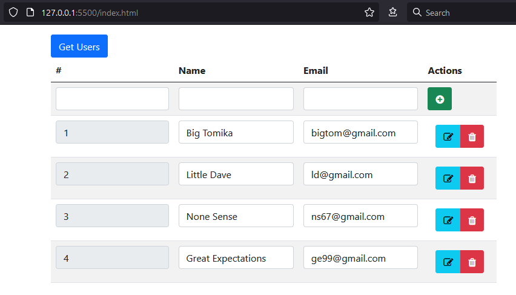

# User Administration CRUD demo with fake DB server (NodeJS json-server)

* install [NodeJS](https://nodejs.org/en/download/) (if not done already)

* install `json-server` globally (if not done already)
```bash
npm install -g json-server
```

* clone this repository into your projects folder
```bash
git clone https://github.com/ruszkipista/ut01-user-admin.git
```

* start the JSON server with
```BASH
json-server --watch db.json
```

* start your webserver with `index.html`